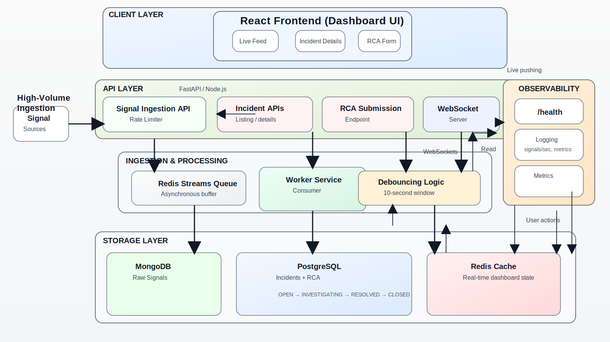

# Incident Management System

Production-grade Incident Management System (IMS) for high-throughput signal ingestion, debouncing, incident lifecycle management, RCA enforcement, and a real-time dashboard.

## Folder Structure

```text
/backend   FastAPI backend, worker, repositories, tests
/frontend  React + Vite real-time dashboard
/docs      Architecture, LLD, and sample failure scenarios
```

## Architecture



### Core Flow

1. Clients submit JSON signals to `POST /api/signals`.
2. The API rate-limits and persists raw signals in MongoDB, then enqueues them to Redis Streams.
3. The worker consumes the stream, debounces by `component_id` for 10 seconds, and creates at most one incident per window.
4. Incident state moves through `OPEN -> INVESTIGATING -> RESOLVED -> CLOSED`.
5. Closing is blocked until a valid RCA exists.
6. Dashboard clients receive live updates over WebSockets.

## Tech Stack Justification

- Backend: FastAPI for async ingestion and WebSocket support.
- Queue: Redis Streams for low-latency async processing and consumer groups.
- SQL store: PostgreSQL for incident and RCA source of truth.
- NoSQL store: MongoDB for raw signal durability and signal-to-incident linkage.
- Cache: Redis for debounce state, rate limiting, and dashboard fan-out.
- Frontend: React + Vite for a responsive, real-time operator console.

## Setup With Docker

```bash
docker compose up --build
```

Services:
- Frontend: http://localhost:5173
- Backend API: http://localhost:8000/api
- PostgreSQL: localhost:5432
- MongoDB: localhost:27017
- Redis: localhost:6379

## Local Development

1. Start PostgreSQL, MongoDB, and Redis on your machine using the same ports as above.
2. Copy `.env.example` to `.env` if you want to override any defaults.
3. Run the backend:

```bash
cd backend
uvicorn app.main:app --reload --host 0.0.0.0 --port 8000
```

4. Run the frontend:

```bash
cd frontend
npm install
npm run dev
```

5. Open the frontend at http://localhost:5173. The Vite dev server proxies API and WebSocket traffic to http://localhost:8000.

## API Documentation

### Ingestion

`POST /api/signals`

```json
{
  "component_id": "payments-api",
  "severity": "P0",
  "source": "pagerduty",
  "summary": "DB connection pool exhausted",
  "payload": {"host": "db-01"}
}
```

### Incident Operations

- `GET /api/incidents`
- `GET /api/incidents/{incident_id}`
- `PATCH /api/incidents/{incident_id}/status`
- `POST /api/incidents/{incident_id}/rca`
- `POST /api/incidents/{incident_id}/close`
- `GET /api/incidents/{incident_id}/insights`

### Health

- `GET /health` returns `{ "status": "ok" }`
- `GET /api/health`

### WebSocket

- `/ws/incidents` streams incident updates to the dashboard.

## Backpressure Handling

- Redis rate limiting throttles producers before the queue is overloaded.
- Redis Streams decouple ingestion from processing and absorb bursts.
- Debounce keys prevent duplicate incident creation during hot windows.
- The queue depth can be scaled horizontally by adding worker replicas.
- Dashboard consumers read from Redis pub/sub so UI updates stay decoupled from API latency.
- Worker retries failed signal processing with exponential backoff (3 attempts).
- Failed events are intentionally left unacked in the stream pending list for replay/recovery.

## Design Patterns Used

- Strategy Pattern: severity-specific alert routing.
- State Pattern: incident lifecycle transitions.
- Repository Pattern: storage access for SQL, MongoDB, and Redis.
- Dependency Injection: FastAPI service container.
- Worker Pattern: async signal processing via Redis Streams consumer groups.

## Scaling Strategy

- Scale the API horizontally behind a load balancer.
- Scale workers independently based on stream lag.
- Partition Redis Streams by tenant or component namespace if needed.
- Add read replicas for PostgreSQL dashboard queries.
- Move aggregation queries to TimescaleDB or Elasticsearch when cardinality grows.
- Offload alert fan-out to dedicated notification workers.

## Trade-offs

- Redis Streams were chosen instead of Kafka for simpler local deployment and lower operational overhead.
- MongoDB stores raw signals for flexibility, while PostgreSQL remains the source of truth for incidents and RCA.
- The WebSocket hub uses Redis pub/sub, which is lightweight but not durable; a durable event bus can replace it later.
- The RCA suggestion engine is heuristic-based and can be replaced with a model-backed service without changing the API contract.

## Bonus Features

- RCA suggestion endpoint using historical incident titles.
- Severity-specific alert routing strategy.
- Real-time incident timeline and live dashboard updates.
- Priority auto-escalation helper in the insights service.

## Sample Failure Scenarios

See [`docs/samples/failure_scenarios.json`](docs/samples/failure_scenarios.json).

### Replay Script

Use the script below to generate immediate demo incidents, including burst traffic:

```bash
python3 docs/samples/replay_scenarios.py --base-url http://127.0.0.1:5173 --scenario all --burst-repeat 50
```

Useful presets:

- RDBMS failure P0 only:

```bash
python3 docs/samples/replay_scenarios.py --scenario rdbms_failure_p0
```

- Cache failure P2 only:

```bash
python3 docs/samples/replay_scenarios.py --scenario cache_failure_p2
```

- Burst signals only:

```bash
python3 docs/samples/replay_scenarios.py --scenario burst_signals --burst-repeat 100 --delay-ms 10
```
